# 🚀 System Design: Scaling - Complete Guide

*Master scaling concepts for FAANG/MAANG interviews*

## Table of Contents
1. [What is Scaling?](#what-is-scaling)
2. [Why Do We Need Scaling?](#why-do-we-need-scaling)
3. [Types of Scaling](#types-of-scaling)
4. [Vertical Scaling (Scale Up)](#vertical-scaling-scale-up)
5. [Horizontal Scaling (Scale Out)](#horizontal-scaling-scale-out)
6. [Horizontal vs Vertical Comparison](#horizontal-vs-vertical-comparison)
7. [Hybrid Scaling Approach](#hybrid-scaling-approach)
8. [Scaling Decision Framework](#scaling-decision-framework)
9. [Real-World Scaling Examples](#real-world-scaling-examples)
10. [Scaling Best Practices](#scaling-best-practices)
11. [Interview Questions on Scaling](#interview-questions-on-scaling)
12. [Key Points Summary](#key-points-summary)

---

## What is Scaling?

**Scaling** (also called **Scalability**) is a system's ability to handle increased workload - more users, more data, or more transactions - while maintaining performance and reliability.

> 🎯 **Simple Definition**: Scaling = Growing your system to handle more load without breaking

### Real-World Analogy

Think of scaling like managing a restaurant:

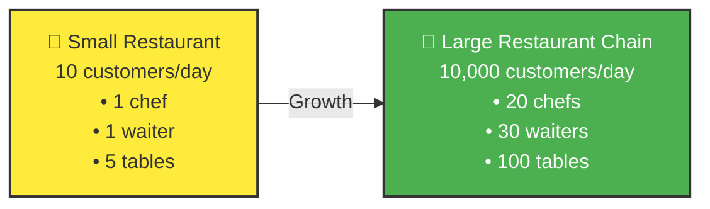

Similarly, your software system needs to grow to handle more users!

---

## Why Do We Need Scaling?

### 📈 Growth Challenges

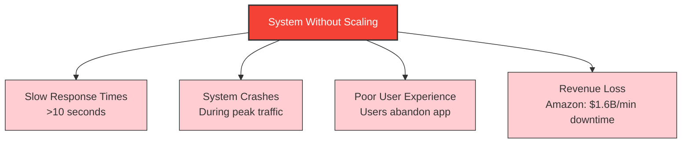

### 🎯 Business Drivers for Scaling

| **📊 User Growth** | **💾 Data Growth** |
|---|---|
| • Instagram: 0 → 1B users | • YouTube: 500 hours uploaded/minute |
| • TikTok: 0 → 1B users in 3 years | • Facebook: 4 petabytes of data/day |
| • ChatGPT: 0 → 100M users in 2 months | • Twitter: 500M tweets/day |

| **⚡ Performance Requirements** | **💰 Cost Efficiency** |
|---|---|
| • Page load: <100ms | • Scale up during peak hours |
| • API response: <50ms | • Scale down during low traffic |
| • 99.99% uptime (4 min downtime/month) | • Pay only for what you use |

### 📊 Scaling Metrics to Track

> 🎯 **Key Performance Indicators (KPIs)**
> - **Response Time**: How fast your system responds
> - **Throughput**: Requests handled per second (RPS)
> - **Concurrent Users**: Users active at the same time
> - **Error Rate**: Percentage of failed requests
> - **Resource Utilization**: CPU, Memory, Disk usage

---

## Types of Scaling

There are two fundamental approaches to scaling any system:

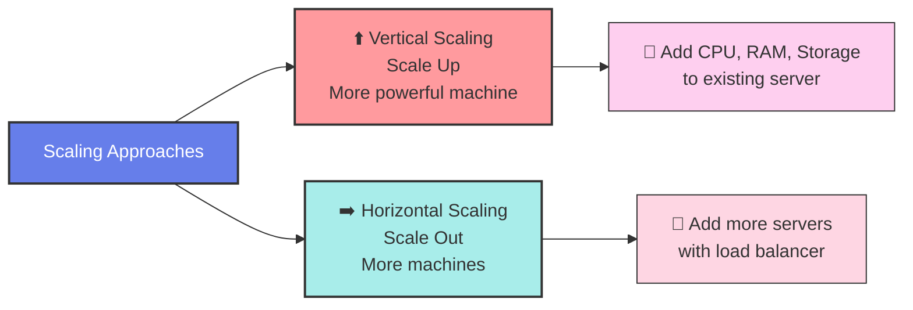

---

## Vertical Scaling (Scale Up)

**Vertical Scaling** means adding more power (CPU, RAM, Storage) to your existing machine.

### 🔧 How Vertical Scaling Works

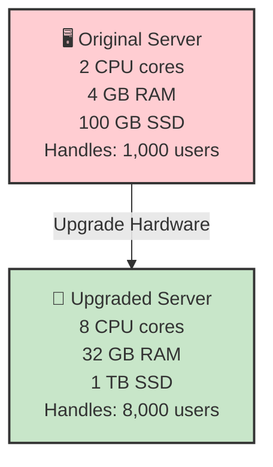

### 💰 Real-World Examples of Vertical Scaling

> ☁️ **Cloud Platform Examples**
> - **AWS EC2**: t3.micro → t3.2xlarge (1 vCPU → 8 vCPU)
> - **Google Cloud**: n1-standard-1 → n1-standard-16
> - **Azure**: Standard_B1s → Standard_B16ms

### ✅ Advantages of Vertical Scaling

> 🎯 **Pros**
> - ✅ **Simple Implementation**: No code changes required
> - ✅ **No Architectural Complexity**: Keep existing design
> - ✅ **Better for Single-threaded Apps**: More CPU power helps
> - ✅ **Consistent Performance**: No network latency between components
> - ✅ **ACID Compliance**: Easier to maintain database consistency
> - ✅ **Quick Solution**: Can be done in minutes

### ❌ Disadvantages of Vertical Scaling

> ⚠️ **Cons**
> - ❌ **Hardware Limits**: Can't exceed maximum CPU/RAM available
> - ❌ **Single Point of Failure**: If server fails, everything goes down
> - ❌ **Expensive**: High-end servers cost exponentially more
> - ❌ **Downtime Required**: Need to restart server for upgrades
> - ❌ **Limited Scalability**: Eventually hit the ceiling
> - ❌ **Vendor Lock-in**: Dependent on specific hardware

### 📊 Vertical Scaling Cost Analysis

💸 **Cost Progression (AWS EC2 Example)**

| Instance Type | vCPU | RAM | Cost/Month | Performance |
|---------------|------|-----|------------|-------------|
| t3.micro | 2 | 1 GB | $8 | 1x |
| t3.large | 2 | 8 GB | $67 | 4x |
| t3.2xlarge | 8 | 32 GB | $270 | 16x |
| **r5.24xlarge** | **96** | **768 GB** | **$4,838** | **100x+** |

> **Notice**: Cost increases exponentially, not linearly!

### 🎯 When to Use Vertical Scaling

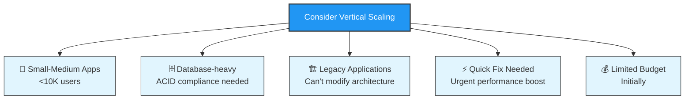

---

## Horizontal Scaling (Scale Out)

**Horizontal Scaling** means adding more servers/machines to distribute the workload.

### 🔧 How Horizontal Scaling Works

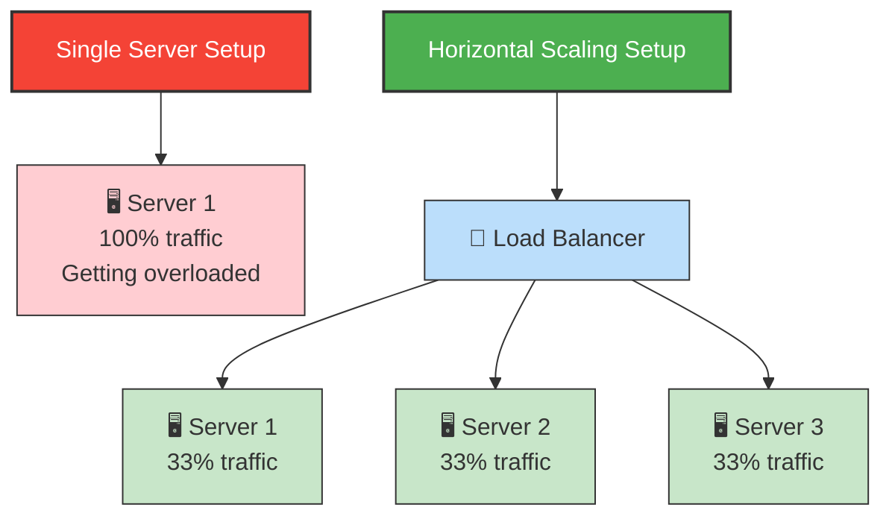

### 🏗️ Components Needed for Horizontal Scaling

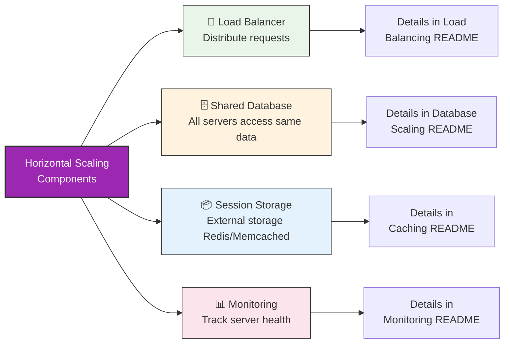

### 💰 Real-World Examples of Horizontal Scaling

> 🌍 **Major Companies Using Horizontal Scaling**
> - **Netflix**: 1000+ microservices across thousands of servers
> - **Google**: Millions of servers in data centers worldwide  
> - **Facebook**: Auto-scales from thousands to tens of thousands of servers during peak
> - **Amazon**: E-commerce platform scales to handle Black Friday traffic spikes

### ✅ Advantages of Horizontal Scaling

> 🎯 **Pros**
> - ✅ **No Hardware Limits**: Can keep adding servers indefinitely
> - ✅ **High Availability**: If one server fails, others continue working
> - ✅ **Cost Effective**: Use cheaper commodity hardware
> - ✅ **Fault Tolerance**: System survives individual component failures
> - ✅ **Geographic Distribution**: Servers can be in different regions
> - ✅ **Elastic Scaling**: Add/remove servers based on demand
> - ✅ **Better Resource Utilization**: Spread load efficiently

### ❌ Disadvantages of Horizontal Scaling

> ⚠️ **Cons**
> - ❌ **Complex Architecture**: Need load balancers, distributed systems
> - ❌ **Network Latency**: Communication between servers takes time
> - ❌ **Data Consistency Challenges**: Harder to maintain consistent state
> - ❌ **More Moving Parts**: More things that can go wrong
> - ❌ **Operational Overhead**: Need to manage many servers
> - ❌ **Application Changes Required**: Code must be stateless
> - ❌ **Initial Complexity**: Takes time to set up properly

### 📊 Horizontal Scaling Cost Analysis

💰 **Cost Efficiency Example**

| Approach | Configuration | Total Cost/Month | Handles Users | Availability |
|----------|---------------|------------------|---------------|--------------|
| Vertical | 1x r5.24xlarge | $4,838 | 50,000 | Single point of failure |
| **Horizontal** | **10x m5.2xlarge** | **$2,760** | **50,000** | **High availability** |

> **Result**: Horizontal scaling costs 43% less with better availability!

### 🎯 When to Use Horizontal Scaling

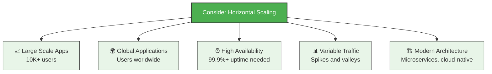

---

## Horizontal vs Vertical Comparison

### 📊 Detailed Comparison Table

| Aspect | Vertical Scaling ⬆️ | Horizontal Scaling ➡️ |
|--------|-------------------|----------------------|
| **Definition** | Add more power to existing machine | Add more machines to system |
| **Implementation** | Upgrade CPU, RAM, Storage | Add servers + Load balancer |
| **Complexity** | ✅ Simple (No code changes) | ❌ Complex (Architecture changes) |
| **Cost (Small Scale)** | ✅ Lower initial cost | ❌ Higher initial setup |
| **Cost (Large Scale)** | ❌ Exponentially expensive | ✅ Linear cost increase |
| **Scalability Limits** | ❌ Hardware ceiling | ✅ Nearly unlimited |
| **Availability** | ❌ Single point of failure | ✅ High availability |
| **Performance** | ✅ No network overhead | ⚠️ Network latency |
| **Data Consistency** | ✅ Easy to maintain | ❌ Complex to maintain |
| **Downtime** | ❌ Required for upgrades | ✅ Zero downtime scaling |
| **Geographic Distribution** | ❌ Single location | ✅ Multiple regions |

### 🎯 Decision Matrix

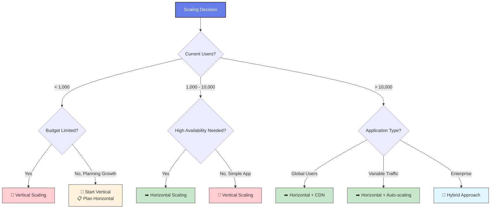

---

## Hybrid Scaling Approach

Most real-world systems use a combination of both vertical and horizontal scaling for optimal results.

### 🔄 The Hybrid Strategy

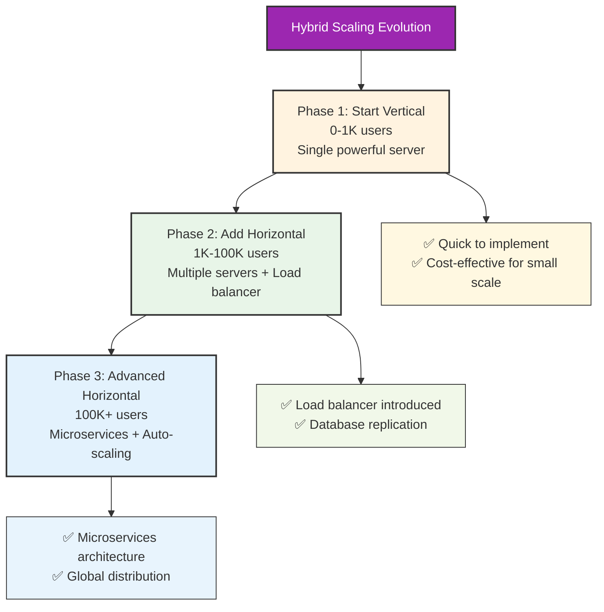

### 🏢 Real-World Hybrid Examples

| 📱 Instagram's Evolution | 🛒 E-commerce Platform |
|---|---|
| **2010**: 1 Django server (vertical) | **Web Tier**: Horizontal (stateless servers) |
| **2012**: Multiple web servers + database sharding | **Database**: Vertical (powerful DB servers) + Read replicas (horizontal) |
| **2020**: Microservices + global CDN | **Cache**: Horizontal (distributed Redis) |

### 🎯 Hybrid Scaling Benefits

> ✅ **Why Hybrid Works Best**
> - **Cost Optimization**: Use vertical for databases, horizontal for web servers
> - **Performance Balance**: Fast single-node performance + distributed load handling
> - **Gradual Transition**: Start simple, add complexity as needed
> - **Component-Specific**: Choose best approach for each system component
> - **Risk Mitigation**: Not dependent on single scaling approach

---

## Scaling Decision Framework

Use this framework to decide your scaling strategy systematically:

### 🔍 Step 1: Analyze Current Bottlenecks

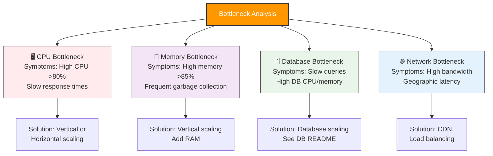

### 📊 Step 2: Evaluate Requirements

> 📋 **Requirements Checklist**

| 📈 Scale Requirements | ⚡ Performance Requirements | 💰 Business Constraints |
|---|---|---|
| Current users: ____ | Response time: <__ ms | Budget: $____/month |
| Target users: ____ | Throughput: __ req/sec | Timeline: __ weeks |
| Growth timeline: ____ | Availability: ___% | Team size: __ people |
| Peak traffic multiplier: ____ | Error rate: <__% | Expertise level: ____ |

### 🎯 Step 3: Choose Scaling Strategy

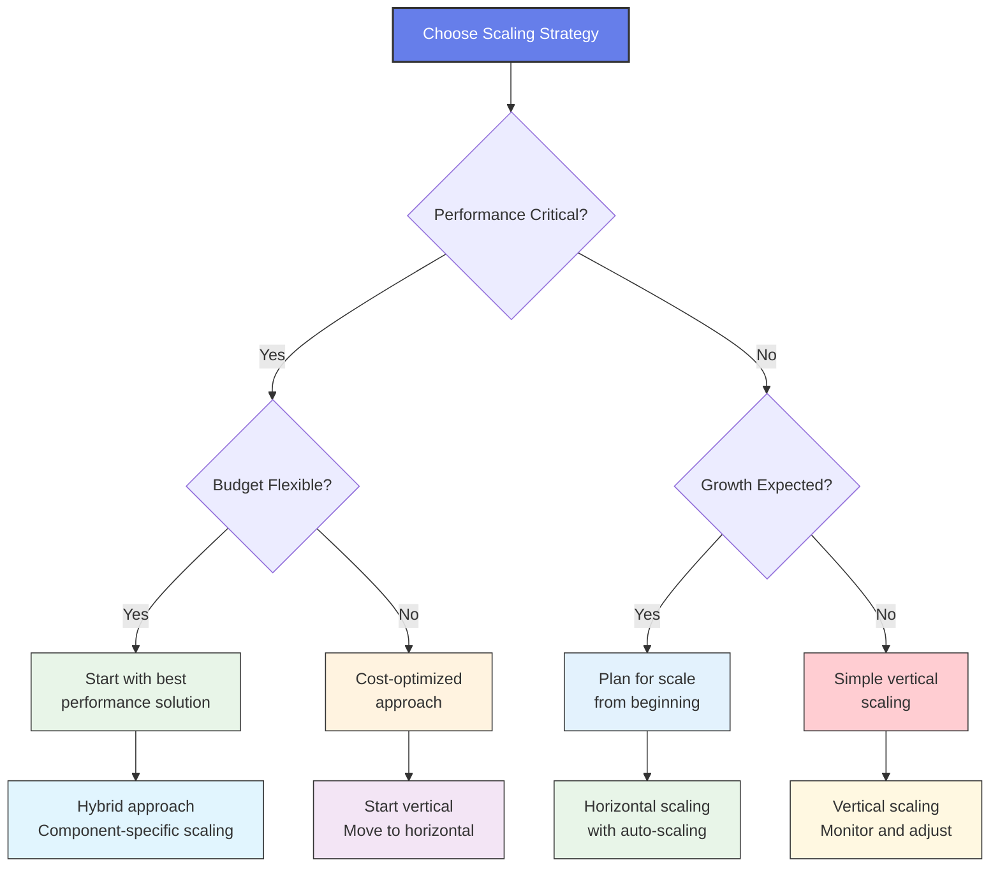

---

## Real-World Scaling Examples

### 🚀 Startup Scaling Journey

**📱 "SocialApp" - From 0 to 10M Users**

```mermaid
timeline
    title SocialApp Scaling Journey
    
    section Stage 1: MVP Launch
        0-1K users    : Single t3.medium server
                      : PostgreSQL on same server
                      : $50/month
                      : Vertical scaling when needed
    
    section Stage 2: Growth Phase  
        1K-50K users  : Response times >500ms
                      : Upgrade to t3.xlarge
                      : Separate database server
                      : Add Redis for sessions
                      : $400/month
    
    section Stage 3: Viral Growth
        50K-500K users: CPU limits (95% usage)
                       : Add load balancer
                       : 3 web servers
                       : Database read replicas
                       : CDN for static assets
                       : $2,000/month
    
    section Stage 4: Scale Phase
        500K-10M users: Global user base
                       : Microservices architecture
                       : Auto-scaling groups
                       : Database sharding
                       : Multi-region deployment
                       : $50,000/month
```

### 🏢 Enterprise Scaling Examples

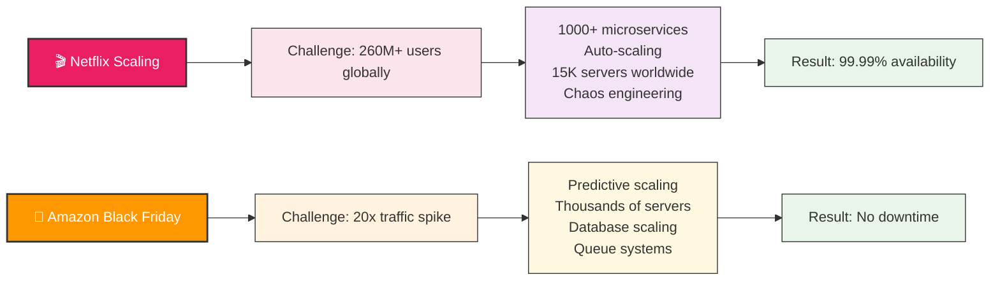

---

## Scaling Best Practices

### 🎯 Design Principles for Scalable Systems

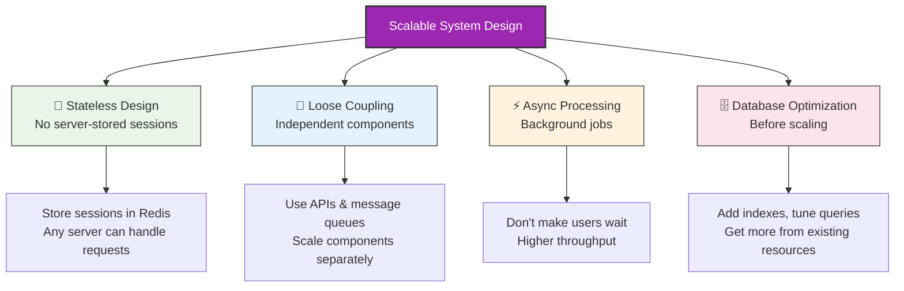

### 📈 Scaling Implementation Checklist

> ✅ **Pre-Scaling Checklist**

**🔍 Before You Scale:**
- ☑️ **Profile your application** - Identify actual bottlenecks
- ☑️ **Optimize database queries** - Add indexes, tune queries  
- ☑️ **Implement caching** - Cache frequently accessed data
- ☑️ **Review algorithms** - Optimize inefficient code
- ☑️ **Monitor key metrics** - Set up proper monitoring
- ☑️ **Load testing** - Understand current capacity

**⚙️ During Scaling:**
- ☑️ **Start small** - Scale incrementally
- ☑️ **Monitor closely** - Watch for issues
- ☑️ **Test thoroughly** - Verify system works
- ☑️ **Have rollback plan** - Be able to revert changes
- ☑️ **Document changes** - Keep track of what you did

**🔄 After Scaling:**
- ☑️ **Validate performance** - Measure improvements
- ☑️ **Optimize costs** - Right-size resources
- ☑️ **Plan next steps** - Prepare for future growth
- ☑️ **Update documentation** - Keep architecture docs current
- ☑️ **Train team** - Ensure team understands new setup

### ⚠️ Common Scaling Mistakes to Avoid

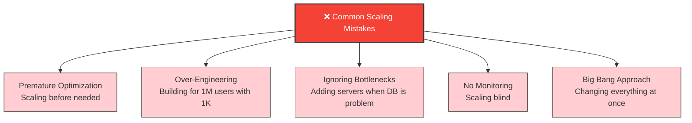

---

## Interview Questions on Scaling

### 🎯 Beginner Level (0-2 years)

<details>
<summary><strong>1. What is the difference between horizontal and vertical scaling?</strong></summary>

**Expected Answer:**
- **Vertical Scaling**: Adding more power (CPU, RAM) to existing server
- **Horizontal Scaling**: Adding more servers to distribute load
- Give examples: upgrading server specs vs adding more servers

**Follow-up**: When would you use each approach?
</details>

<details>
<summary><strong>2. Why do we need to scale systems?</strong></summary>

**Expected Answer:**
- Handle more users/traffic
- Maintain performance as system grows  
- Ensure high availability
- Meet user expectations for speed

**Follow-up**: What happens if we don't scale?
</details>

<details>
<summary><strong>3. What are the advantages and disadvantages of vertical scaling?</strong></summary>

**Expected Answer:**
- **Advantages**: Simple, no architecture changes, better for databases
- **Disadvantages**: Hardware limits, single point of failure, expensive

**Follow-up**: Give a real-world example of when you'd choose vertical scaling
</details>

### 🎯 Intermediate Level (2-5 years)

<details>
<summary><strong>4. How would you scale a web application from 1,000 to 100,000 users?</strong></summary>

**Expected Answer Framework:**
1. **Identify bottlenecks**: Monitor CPU, memory, database performance
2. **Start with vertical scaling**: Upgrade server specs
3. **Add horizontal scaling**: Load balancer + multiple servers
4. **Scale database**: Read replicas, potential sharding
5. **Add caching**: Redis/Memcached for frequent data
6. **Monitor and optimize**: Continuous performance monitoring

**Follow-up**: What would be your first step?
</details>

<details>
<summary><strong>5. Your application is experiencing slow database queries. How do you scale?</strong></summary>

**Expected Answer:**
1. **First optimize**: Add indexes, optimize queries
2. **Vertical scaling**: Upgrade database server (more RAM/CPU)
3. **Read replicas**: Distribute read traffic
4. **Caching**: Cache query results
5. **Sharding**: If data is too large for single server

**Follow-up**: How do you decide between these options?
</details>

<details>
<summary><strong>6. Explain the challenges of horizontal scaling</strong></summary>

**Expected Answer:**
- **Complexity**: Need load balancers, distributed architecture
- **Data consistency**: Keeping data synchronized across servers
- **Session management**: Users might hit different servers
- **Network latency**: Communication between servers
- **Debugging**: Issues across multiple servers harder to trace

**Follow-up**: How would you address session management?
</details>

### 🎯 Advanced Level (5+ years)

<details>
<summary><strong>7. Design a scaling strategy for a global social media platform</strong></summary>

**Expected Comprehensive Answer:**
1. **Multi-region deployment**: Data centers worldwide
2. **Microservices architecture**: Independent scaling of features
3. **Database strategy**: Sharding by user geography/ID
4. **CDN**: Global content delivery for media
5. **Auto-scaling**: Dynamic capacity based on traffic
6. **Caching strategy**: Multi-level caching
7. **Message queues**: Async processing for posts/notifications

**Follow-up**: How would you handle data consistency across regions?
</details>

<details>
<summary><strong>8. How would you migrate from vertical to horizontal scaling with zero downtime?</strong></summary>

**Expected Migration Strategy:**
1. **Prepare**: Make application stateless
2. **Setup**: Configure load balancer with current server
3. **Add servers**: Gradually add new servers to pool
4. **Test**: Route small percentage of traffic to new servers
5. **Migrate**: Gradually shift traffic to new architecture
6. **Monitor**: Watch for issues throughout process
7. **Cleanup**: Remove old infrastructure

**Follow-up**: What are the risks and how do you mitigate them?
</details>

<details>
<summary><strong>9. You need to scale a system that handles financial transactions. What are the special considerations?</strong></summary>

**Expected Answer (Security & Compliance Focus):**
- **ACID compliance**: Maintain transaction integrity
- **Security**: Encryption, secure communication
- **Audit trail**: Log all transactions
- **Regulatory compliance**: Meet financial regulations
- **Availability**: 99.99%+ uptime requirements
- **Data consistency**: No lost or duplicate transactions
- **Disaster recovery**: Backup and recovery procedures

**Follow-up**: How do you ensure data consistency in a distributed financial system?
</details>

### 🎯 Scenario-Based Questions

<details>
<summary><strong>10. "Your e-commerce site is about to launch a Black Friday sale. How do you prepare for 10x traffic?"</strong></summary>

**Expected Preparation Strategy:**
1. **Capacity planning**: Estimate expected traffic based on historical data
2. **Pre-scaling**: Scale up infrastructure before the event
3. **Database prep**: Optimize queries, add read replicas
4. **CDN setup**: Cache static assets and product images
5. **Queue systems**: Handle order processing asynchronously
6. **Monitoring**: Set up alerts for key metrics
7. **Rollback plan**: Have plan to handle failures

**Follow-up**: How do you handle payment processing at scale?
</details>

<details>
<summary><strong>11. "Your startup just went viral and traffic increased 100x overnight. What do you do?"</strong></summary>

**Crisis Response Plan:**
1. **Immediate**: Scale vertically to buy time
2. **Short-term**: Add horizontal scaling quickly
3. **Identify bottlenecks**: Find what's breaking first
4. **Emergency caching**: Cache everything possible
5. **Rate limiting**: Protect system from overload
6. **Communication**: Update users about any issues
7. **Plan long-term**: Prepare for sustained growth

**Follow-up**: How do you prioritize which issues to fix first?
</details>

---

## Key Points Summary

### 🎯 Quick Reference for Interviews

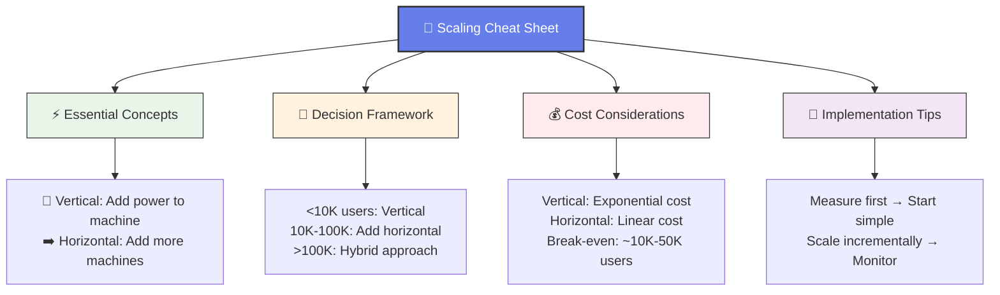

### 🗣️ Interview Success Tips

> 🎯 **How to Answer Scaling Questions**
> 1. **Ask clarifying questions**: "How many users? What's the budget? Timeline?"
> 2. **Start with current state**: "Currently you have X users on Y infrastructure"
> 3. **Identify bottlenecks**: "The database seems to be the bottleneck because..."
> 4. **Suggest solution**: "I'd recommend horizontal scaling because..."
> 5. **Discuss trade-offs**: "This gives us X benefit but costs Y"
> 6. **Plan evolution**: "As we grow further, we'd add Z"

### ❌ Common Interview Mistakes

**Don't say:**
- ❌ "Just add more servers" (without understanding bottlenecks)
- ❌ "Microservices solve everything" (complexity overkill)
- ❌ "Horizontal is always better" (ignores trade-offs)
- ❌ "Scale for 1M users from day 1" (premature optimization)

**Do say:**
- ✅ "Let me first understand the bottleneck..."
- ✅ "I'd start simple and evolve as needed..."
- ✅ "There are trade-offs between approaches..."
- ✅ "Based on the requirements, I'd choose X because..."

### 📊 Numbers to Remember

- **Response time goals**: <100ms web, <1s mobile
- **Availability targets**: 99.9% = 8.7h downtime/year, 99.99% = 52min/year
- **Scaling triggers**: CPU >70% scale up, <30% scale down
- **Cost multiplier**: High-end servers cost 10-100x more than commodity
- **Rule of thumb**: Start vertical, go horizontal after 10K users

---

## 🎯 You're Now Ready to Tackle Scaling Questions!

**Next up**: Deep dive into **Load Balancing**, **Database Scaling**, and **Caching** in their dedicated READMEs!

---

**Related Topics (Separate READMEs):**
- 🔄 **Load Balancing** - Traffic distribution strategies
- 🗄️ **Database Scaling** - Sharding, replication, optimization  
- ⚡ **Caching** - Multi-level caching strategies
- 🌍 **CDN** - Global content delivery
- 🏗️ **Microservices** - Service decomposition and scaling
- 📊 **Monitoring** - Observability and metrics